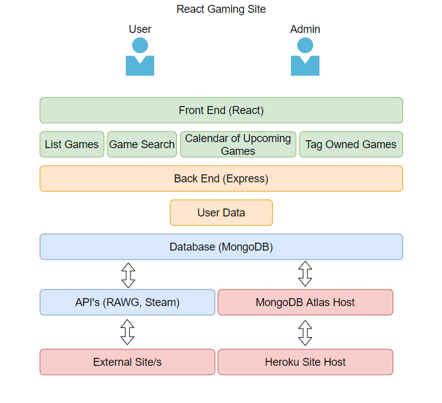
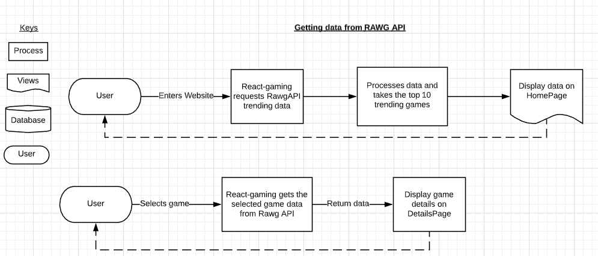
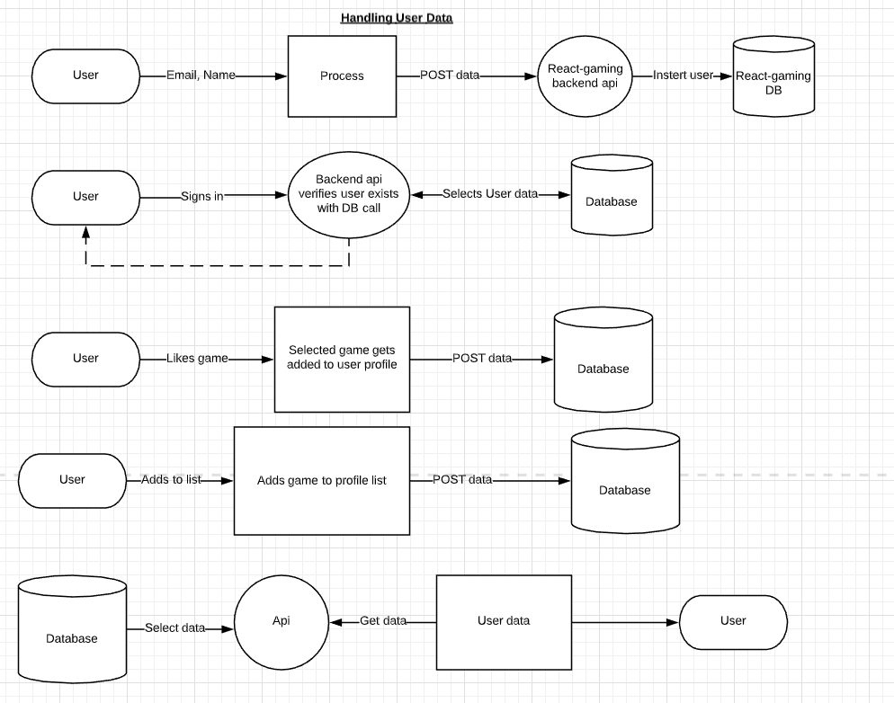
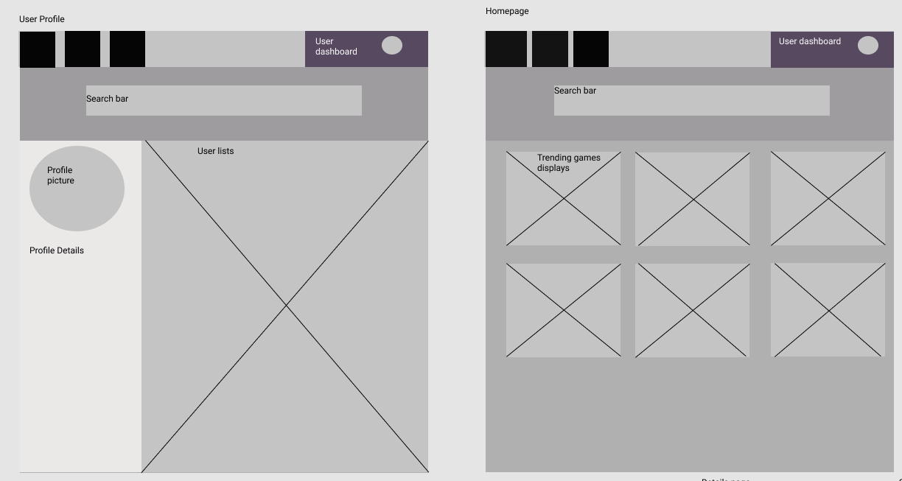
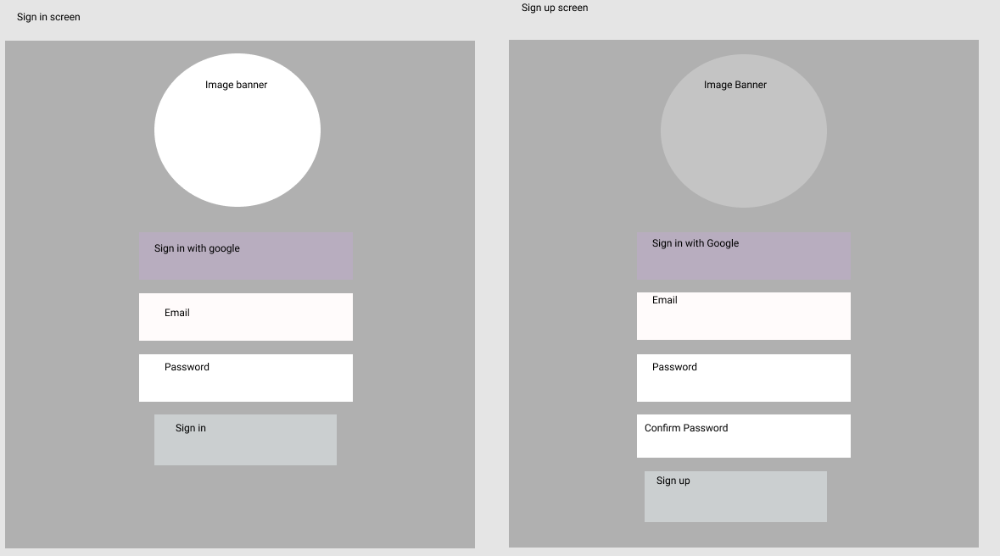
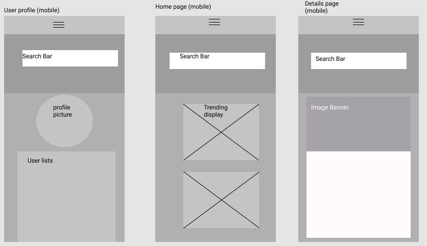
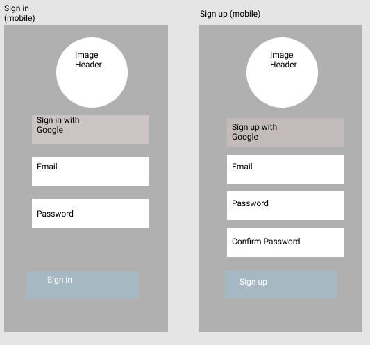

# REACT-Gaming:

Frontend: https://github.com/Radicals27/react-gaming

Backend: https://github.com/Radicals27/backend 

Livesite: https://react-gaming.herokuapp.com/

Backend api: https://react-gaming-backend.herokuapp.com/

 
## Purpose
To inform gamers of upcoming and released games (PC, Console & handheld) that might appeal to them based on their interests.
 
## Functionality / features
The site will feature several API requests to gaming databases such as RAWG, Steam DB and indie game libraries, allowing us to match games based on certain criteria to present to the user.
 
User's can also select which games they already own, and the site will then know more of which games to recommend.
 
User informtation such as username, email, password and interests will be stored in a Database on the server.
 
The site will also feature a calendar to show the user what upcoming games may interest them, that they can opt to follow.
 
## Target audience
The target audience will be gamers (of any major platform or age) who are serious enough about games that they would like to be notified of other titles that they may not be aware of already.
 
## Tech stack
The site features a full MERN stack utilising MongoDB for the user database, Express for the back-end, REACT for the front-end and Node.js for the runtime environment.
 
The entire project is written in JS, and utilises GitHub for version control.

## Application Architecture Diagram

## Data Flow Diagram

## Wireframes

## Trello Board

Link: 

https://trello.com/b/aRXRFprr/react-gaming

Screenshots:

